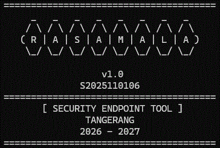

# RASAMALA

The security tool for system diagnostics and issue resolution.

## Well Architected Development Principles
Rasamala eliminates configuration drift and operational waste through a centralized dispatcher and modular design:

- **Operational Excellence**: Modular routing across `Routes/` (Audit, Operation, Remediation pipelines).
- **Security**: Hardened parameters via `[CmdletBinding()]` switches and explicit validation.
- **Reliability**: Strict input validation using `[ValidateSet]` for interval cycles and client profiles.
- **Performance Efficiency**: Dynamic `$PSScriptRoot` sourcing for lean PowerShell pipeline execution.
- **Cost Optimization**: Native OS capabilities with zero external dependencies, backed by `Helpers/`.
- **Sustainability**: Clean, debt-free, modular architecture for modern PowerShell runtimes.
